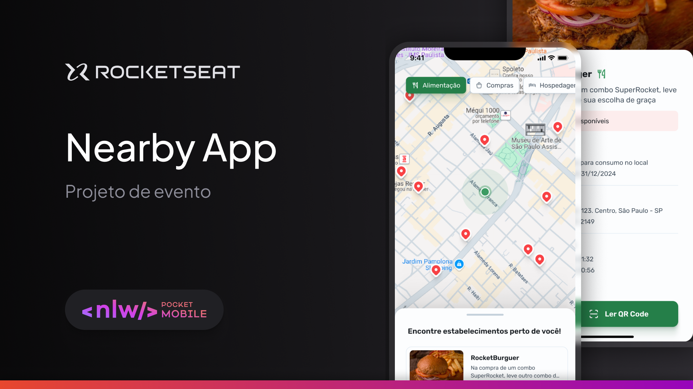

## Nearby App

  

## 🖥️ Sobre o Projeto

Neste repositório está hospedado um aplicativo mobile que mostra estabelecimentos parceiros com benefícios e promoções disponíveis próximas a localização do usuário.

## 🚧 Status

Atualmente o projeto encontra-se em fase de desenvolvimento de requisitos.

## 🍪 Layout do projeto

Você pode estar acessado o layout do projeto através deste link no Figma, [aqui](<https://www.figma.com/design/ADA0OJbTOHUUV4UEGTlOpa/NLW-Pocket-Mobile-%E2%80%A2-Nearby-(Community)?node-id=0-1&node-type=canvas&t=NySbqPTzERB7gu8m-0>).

## 🚀 Tecnologias

As seguintes ferramentas foram usadas para o desenvolvimento do projeto:

  

Feito com ❤️ por Pedro Lucas 👋🏽
